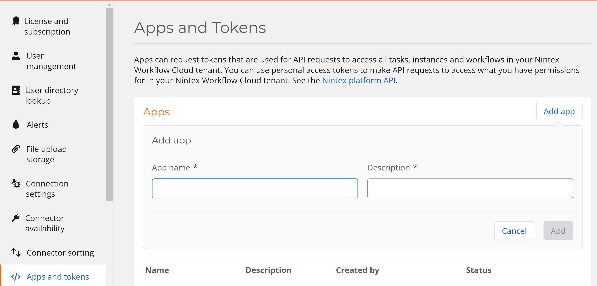
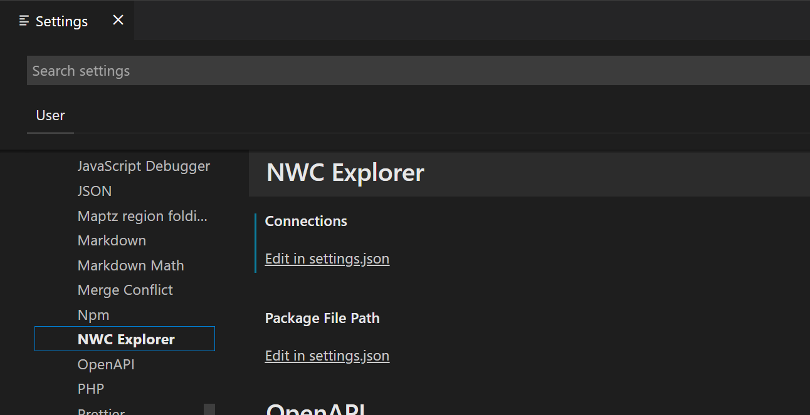
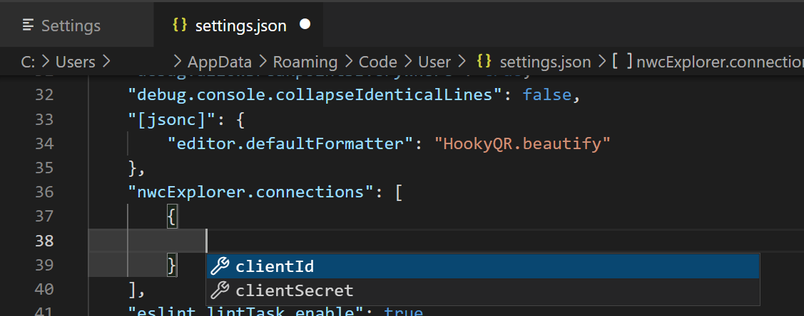
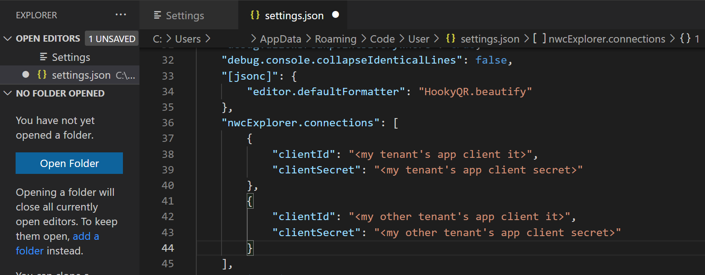
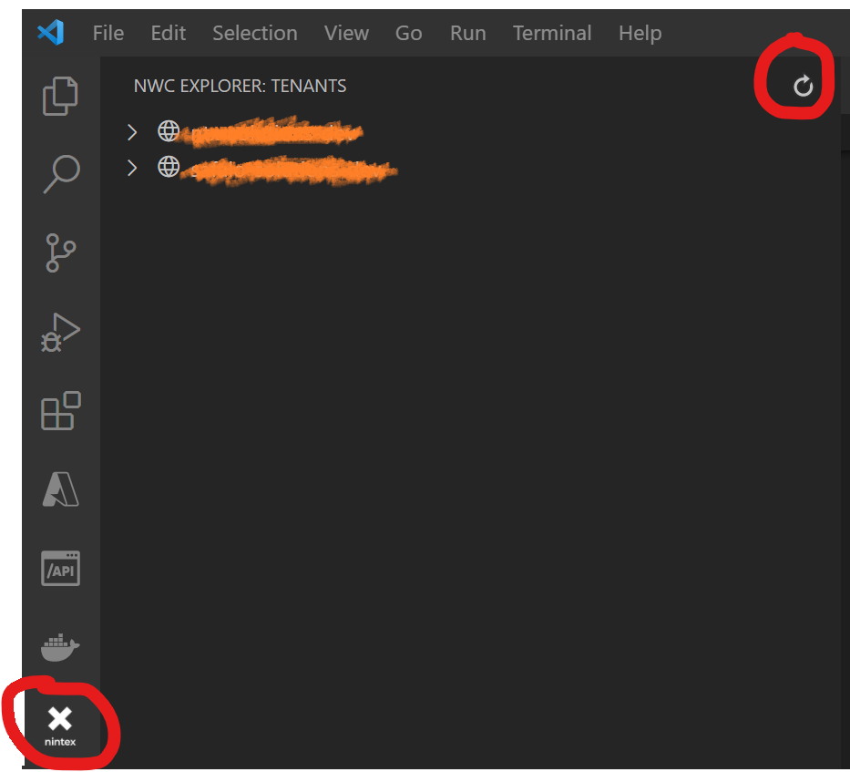

# NWC Explorer for VS Code (alpha)

> Connect to your NWC tenants directly frpom VS Code. Browse your workflows, connections, and datasources. Peek into your workflows and view all the parameters used in the connection actions.

**_Disclaimer_**: _This is **NOT** an official Nintex product. This is a **community** driven project. For any issues, questions, contributions, refer to the project's github repo @ https://github.com/NTX-XT/nwc-sdk_

## How to add your tenants
1. For every tenant you want to add to the explorer, you will need to generate an App from the _Settings > Apps and Tokens_ section of your tenant. There is no specific name required, use whatever works better for your conventions / preferences:

  

2. Once the App is created, open the Settings dialog in VS Code and look for the NWC Explorer extension:

  

3. Click on _Edit in settings.json_ and add the client id and client secret of the App you created on your NWC tenant. You can add more than one tenant:

  

  

4. Save your settings, click on the NWX extension icon on the Side Bar and then click the refresh button on the NWC Explorer: Tenants view. Your tenants should now be visible in the explorer:

  

## What is available now

- Browse a tenant connections, datasources and workflows
- View the connections and tags of every workflow
- View the parameters of every action used by a connection in the workflow
- Right click and select "View Data" to get a JSON object of the data behid each tree node

## What's next

- View the Forms of every workflow, along with the datasources used and their configuration
- Export the definition of a workflow in JSON ( i.e. store it in your version control system, etc.)
- Import and publish an exported definition ( i.e. deploy a workflow from a development tenant to a production one)
- Change the connection and / or the action parameters in a workflow